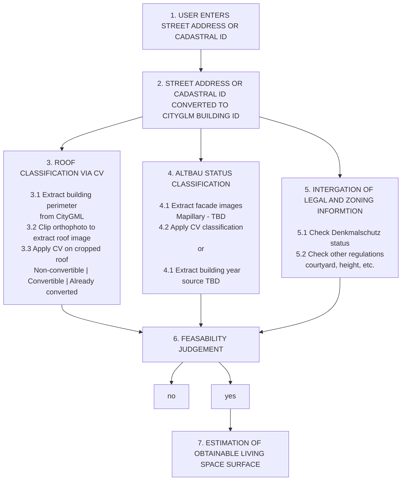

# Attic Conversion Project

> [!NOTE]
> This project is work in progress.

## 1. Overview
The DachAusbau project focuses on identifying buildings with potential for rooftop (attic) conversion using data-driven methods. By leveraging geospatial data, 3D building models, and algorithmic analysis, the project aims to streamline the detection of underutilized roof spaces in urban environments. In cities like Berlin, where housing demand is high, the project enables stakeholders to quickly pinpoint buildings with rooftop conversion potential. This tool is meant to serve as a first scalable screening tool, accelerating development processes. Professional case-by-case techincla assessment can then be pursued after first screening. 

### Objectives
- Automatically identify buildings suitable for attic conversion
- Analyze physical building characteristics (e.g., roof shape, height, volume)
- Support urban development and housing expansion strategies
- Reduce manual effort compared to traditional property assessment

### Benefits
- **Efficiency**: Faster identification of viable buildings compared to manual search
- **Scalability**: Ability to analyze entire cities like Berlin
- **Decision Support**: Useful for urban planners, investors, and architects
- **Housing Impact**: Helps unlock additional living space in dense urban areas

### Use Case

## 2. Data souces

### 3D Building data (LoD2)

- **Description**: *"The dataset contains comprehensive three-dimensional building models of the State of Berlin at Level of Detail 2 (LoD2). The floor plans of the building models correspond exactly to the building boundaries as recorded in the real estate cadastre. The roof shape of a building model corresponds to a generalized standard roof shape."* (translated from https://daten.berlin.de/datensaetze/3d-gebaudemodelle-im-level-of-detail-2-lod-2-3c7c49af, accessed on the 20th March 2026).
- **Source**: provided by the *Senatsverwaltung für Stadtentwicklung, Bauen und Wohnen Berlin* (https://daten.berlin.de/datensaetze/3d-gebaudemodelle-im-level-of-detail-2-lod-2-3c7c49af).
- **How to access**: clicking on the "Resource link leads to the download of the r9Ul3STr, an ATOM feed. Inside this file there is the link http://inspire.ec.europa.eu/schemas/inspire_dls/1.0, which leads to another file download (0.atom) which also contains a list of further links: one link containing the tiling of the state of Berlin and one link for each of the tiles in a zip file. When a zip file is downloaded, it contains only one .xml file, which can be opened in the KITModelViewer software (https://www.iai.kit.edu/english/1302.php) via *File > Open... > Open GML file*. Onece a tile has been loaded, other ones can be merged into it (*File > Merge*) There, the whole tile becomes visible. Each building is divided in subparts (area, walls, roof) and these are also further difided in sub-elements (polygonds). Each building has a unique identifier: glm:id. Note that also subparts have a comparable identifier!
- **License**: Für die Nutzung der Daten ist die Datenlizenz Deutschland - Zero - Version 2.0 anzuwenden. Die Lizenz ist über https://www.govdata.de/dl-de/zero-2-0 abrufbar.
- **Use**: contains information about the geometry of a building including the roof. TThis is useful for:
    - determining feasability: how tall i sthe building, how big is the roof, which geometry the roof has?
    - determining potential attic surface

### Satellite orthophotos
- **Description**: *"The data consists of color digital TrueOrthophotomosaics (TrueDOP). All objects are depicted in their correct orientation, meaning there is no tilting of buildings or trees and, consequently, no shadowing effects on, for example, sidewalks. Data is available for the entire Berlin metropolitan area in 2 km x 2 km grid cells and has a ground resolution of 0.20 m with a positional accuracy of +/- 0.4 m."* (Translated from https://daten.berlin.de/datensaetze/digitale-farbige-trueorthophotos-sommer-2025-truedop20rgbi-687d0f2e, , accessed on the 20th March 2026)
- **Source**: provided by the *Senatsverwaltung für Stadtentwicklung, Bauen und Wohnen Berlin* (https://daten.berlin.de/datensaetze/digitale-farbige-trueorthophotos-sommer-2025-truedop20rgbi-687d0f2e).
- **How to access**: 
- **License**: Für die Nutzung der Daten ist die Datenlizenz Deutschland - Zero - Version 2.0 anzuwenden. Die Lizenz ist über https://www.govdata.de/dl-de/zero-2-0 abrufbar.
- **Use**: Required for examining the roof to detrmine if the attic is already converted (e.g. has windows)

### GPS/street data
- **Use**: to link different data sources and entry point for the user

### Cadastral information? - tbc
- **Use**: to link different data sources and entry point for the user

## 3. Pipeline

## Miscellaneous

- **Dachausbau regulations for Berlin**: https://www.berlin.de/ba-friedrichshain-kreuzberg/politik-und-verwaltung/aemter/stadtentwicklungsamt/themen/bauberatungsservice/artikel.1497107.php
